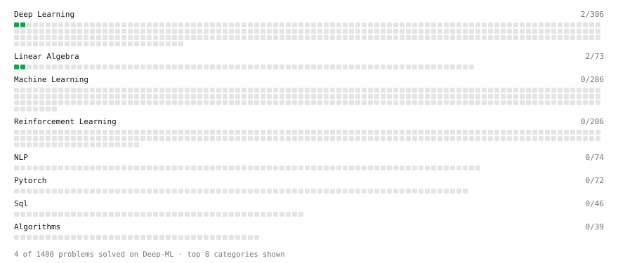

# Deep-ML

My machine learning practice from [Deep-ML](https://www.deep-ml.com). Every solution here was written by hand.

**4** solved · 4 problems · 0 labs · 0 math

[**Browse the interactive portfolio**](https://hasher-E3.github.io/deep-ml/) to replay this filling in over time.

## Problems

| | Difficulty | Solved | |
| --- | --- | --- | --- |
| [Matrix-Vector Dot Product](https://www.deep-ml.com/problems/1) | easy | 2026-08-16 | [solution](problems/0001-matrix-vector-dot-product) |
| [Sigmoid Activation Function Understanding](https://www.deep-ml.com/problems/22) | easy | 2026-08-01 | [solution](problems/0022-sigmoid-activation-function-understanding) |
| [Softmax Activation Function Implementation ](https://www.deep-ml.com/problems/23) | easy | 2026-08-01 | [solution](problems/0023-softmax-activation-function-implementation) |
| [Transpose of a Matrix](https://www.deep-ml.com/problems/2) | easy | 2026-09-08 | [solution](problems/0002-transpose-of-a-matrix) |

---

_This file is regenerated by Deep-ML on every push._
